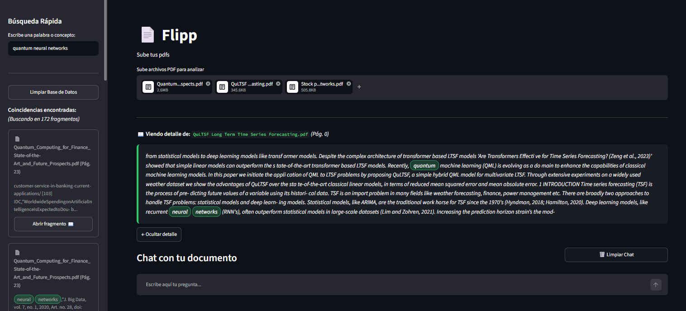
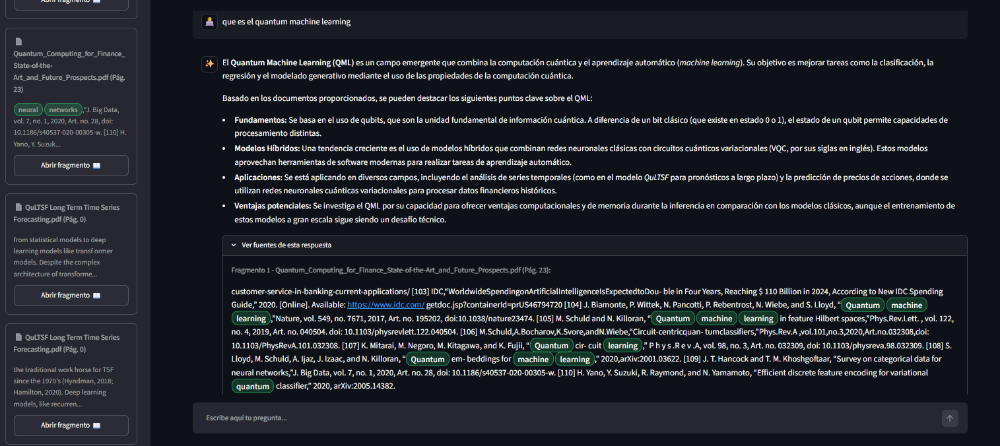
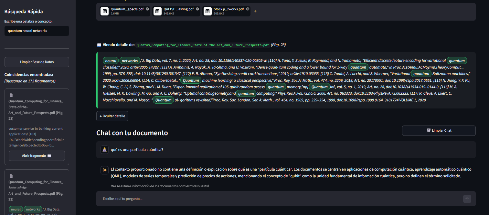

# Flipp

  

  
  

Flipp es una herramienta sencilla construida en Python para subir, leer y hacer preguntas a tus documentos PDF utilizando la arquitectura RAG (Retrieval-Augmented Generation). Permite subir un archivo, indexarlo en una base de datos vectorial y hacer consultas sobre su contenido en lenguaje natural. Es ideal para extraer información específica sin tener que leer documentos largos.

## Lo que hace la aplicación

- **Sube múltiples PDFs:** Puedes cargar varios documentos al mismo tiempo para analizarlos.
- **Búsqueda por fragmentos:** Cuenta con una barra lateral para hacer búsquedas exactas de palabras (tipo Ctrl+F) y te muestra los fragmentos de texto exactos donde aparece.
- **Chat con IA (RAG):** Puedes hacer preguntas en lenguaje natural. La aplicación utiliza Inteligencia Artificial para leer los fragmentos de tus PDFs y darte una respuesta basada 100% en tus documentos.
- **Fuentes transparentes:** Cada vez que la IA responde, te muestra exactamente de qué páginas y archivos sacó la información, resaltando las palabras clave.
- **Filtro inteligente:** Si buscas una palabra en la barra lateral, el chat se enfoca automáticamente solo en esos fragmentos encontrados para darte respuestas ultra precisas.

## Cómo Funciona

1. **Procesamiento inicial:** El documento PDF se procesa y se divide en fragmentos de texto más pequeños.
2. **Embedding:** Estos fragmentos se convierten a vectores (representaciones numéricas) y se guardan en ChromaDB.
3. **Recuperación:** Cuando el usuario ingresa una pregunta, el sistema busca en la base de datos los fragmentos que mejor responden a la consulta.
4. **Respuesta:** Se envían los fragmentos encontrados junto a la pregunta al LLM, el cual elabora la respuesta basándose únicamente en la información del documento.

## Tecnologías utilizadas

- **LangChain:** Librería principal para conectar la lectura de PDFs, la base de datos y la IA.
- **Sentence Transformers:** Modelo multilingüe local (`paraphrase-multilingual-MiniLM-L12-v2`) que convierte los textos en vectores para que el sistema entienda el contexto.
- **Google Gemini API:** El motor de IA (Gemini Flash) que procesa los textos y formula las respuestas al usuario.
- **ChromaDB:** Base de datos vectorial que corre de forma local para almacenar los fragmentos del texto y realizar la búsqueda de similitud.
- **Streamlit:** Framework para la interfaz web.

## Cómo ejecutarlo localmente

1. Clona este repositorio.
2. Crea un entorno virtual e instala las dependencias con `pip install -r requirements.txt`.
3. Crea un archivo llamado `.env` en la carpeta principal y coloca tu clave de API de Google así: `GOOGLE_API_KEY=tu_clave_aqui`.
4. Corre el proyecto usando el comando: `streamlit run app.py`.
